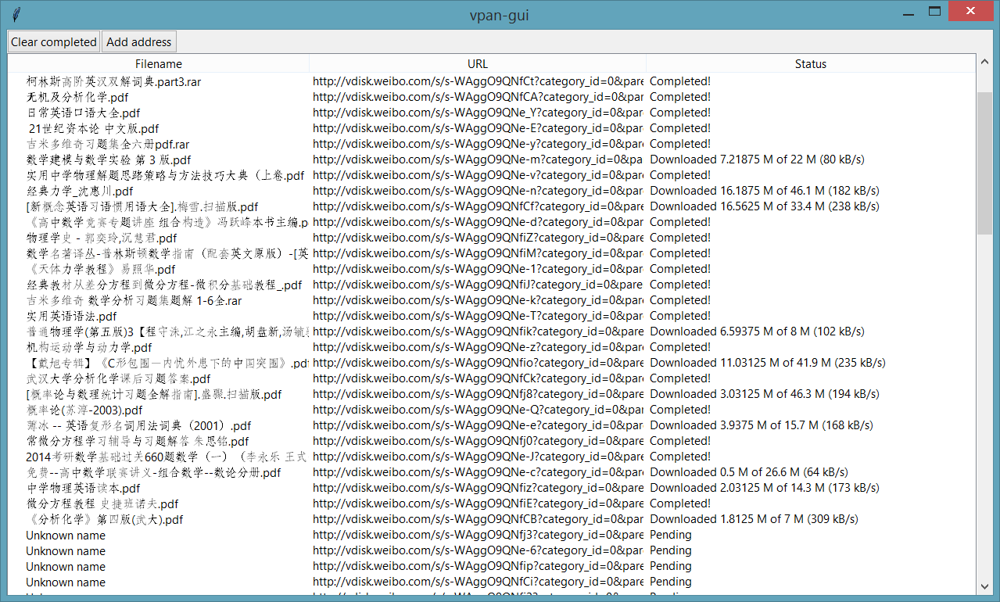

# vpan-gui

An application designed for immediate responses while downloading files. This
program will be due off course and all development halted as of 30th of June.

Demanded recursive downloads would have been available. Upon release, merely
10 days would be possible for the people to carry down publicly available files
from [Weipan](http://vdisk.weibo.com/). Immediate actions should be imposed in
case of any actions for any aspect.

Supporting clipboard monitoring in Windows through the enable of certain lines.
Theoretically usable under Linux, but not throughly tested yet.

Please do not report any bugs before 30th of June, 2016, nor after this particular
timestamp. I oppose and deny any of the accusations for providing certain
technologies to particular people that impose particular actions upon particular
objects, but this is only a **Hello World** project for using *tKinter*.
